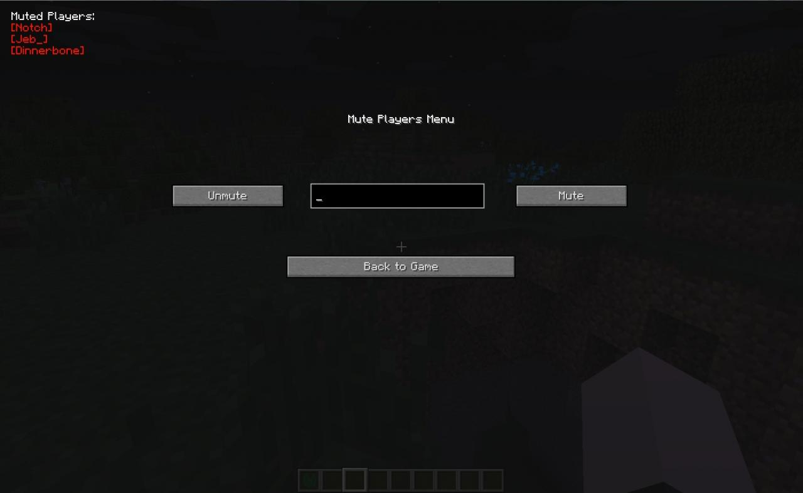

Taciturn Mod
============
Simple Minecraft mod to create a list of users to mute globally.

Just press "M" to open the GUI, input the username, then clik mute or unmute - it's as simple as that.

Must install litemod. Works with Minecraft 1.7.*
